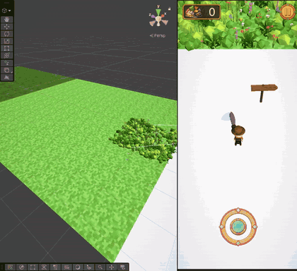
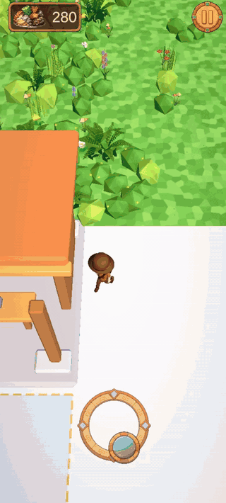
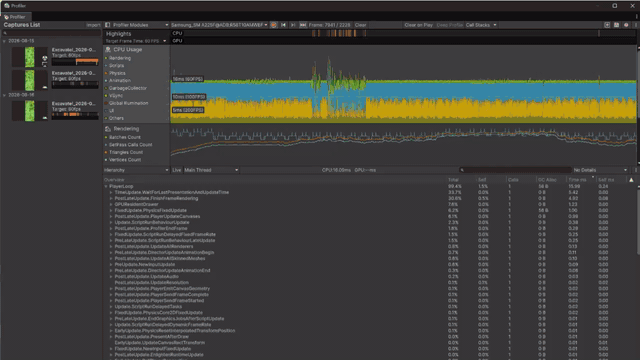

# Excavate! — Unity Developer Showcase

Excavate! is a self-developed 3D mobile hybrid-casual game built with Unity and C# for Android. The game is centered on clearing dense environments, collecting resources, improving tools, and progressing toward archaeological discoveries.

This repository is a focused portfolio case study. It contains selected source files and short recordings from the working project, not the complete Unity project.

| | |
| --- | --- |
| **Role** | Solo Unity Developer |
| **Engine** | Unity 6 |
| **Language** | C# |
| **Platform** | Android |
| **Status** | In development |

## Gameplay

The player clears destructible objects, receives materials, and spends those materials on tool upgrades. Better tool stats allow faster clearing, wider swings, and access to objects with higher tool-level requirements.

## Technical Highlights

### Chunk-Based World Activation

Dense gameplay areas can contain roughly 5,000 interactive objects. Keeping every object active at the same time was unnecessary, so I implemented a position-based chunk system that keeps a configurable area around the player active.

At startup, `ChunkObject` components are collected and grouped by integer chunk coordinates. `ChunkManager` stores those groups in a `Dictionary<Vector2Int, Chunk>` and tracks the required active coordinates with a `HashSet<Vector2Int>`. When the player enters a new chunk, the manager compares the previous and required sets, then queues objects for activation or deactivation. Configurable per-frame limits spread that work across frames instead of switching an entire area at once. Additional sets prevent duplicate queue entries, while the target-state lookup handles objects whose requested state changes before their queued operation is processed.

Code: [ChunkManager.cs](Excavate/Code/World/ChunkManager.cs) · [ChunkObject.cs](Excavate/Code/World/ChunkObject.cs)

### Mining & Destruction

The mining interaction is split into three small components:

`AttackPivot` → `ToolDamage` → `DestructibleObject`

- `AttackPivot` runs the repeating swing coroutine, rotates the attack pivot through a configurable arc, and enables the hit volume and trail only during the swing.
- `ToolDamage` receives trigger contacts, finds a destructible object in the collider hierarchy, checks the current tool level, and either applies damage or requests weak-tool feedback.
- `DestructibleObject` stores health and the required tool level. On destruction it awards materials through `ResourceManager` and removes the object from the scene.

Code: [AttackPivot.cs](Excavate/Code/Mining/AttackPivot.cs) · [ToolDamage.cs](Excavate/Code/Mining/ToolDamage.cs) · [DestructibleObject.cs](Excavate/Code/Mining/DestructibleObject.cs)

### Resources & Progression

`ResourceManager` owns the material balance, updates its UI counter, and exposes a guarded spend operation. `UpgradesManager` uses serialized level data to price and apply upgrades for swing speed, mining angle, and tool hardness. These upgrades feed back into `AttackPivot` and `ToolDamage`, connecting progression directly to mining behavior and access requirements.

Code: [ResourceManager.cs](Excavate/Code/Progression/ResourceManager.cs) · [UpgradesManager.cs](Excavate/Code/Progression/UpgradesManager.cs)

## Performance / Android

The project is designed for Android and was profiled directly on an Android device with Unity Profiler while running dense gameplay areas. Profiling identified rendering/GPU work as the main bottleneck. The optimization pass covered material usage, shader cost, shadows, render scale, and URP settings, with CPU and GPU behavior checked during iteration.

After that work, the tested Android build reached and held the 60 FPS target during the steady-state portions of the recorded scenario. The trace also shows short transient spikes, so this result is specific to the demonstrated device, build, and gameplay conditions—not a guarantee for every Android device or every game state. The chunk system is presented as a separate world-management solution and is not claimed as the sole cause of the final frame rate.

## Selected Code

| System | Files | Demonstrates |
| --- | --- | --- |
| World activation | [ChunkManager.cs](Excavate/Code/World/ChunkManager.cs), [ChunkObject.cs](Excavate/Code/World/ChunkObject.cs) | Spatial grouping, active-set comparison, queued per-frame state changes |
| Mining / destruction | [AttackPivot.cs](Excavate/Code/Mining/AttackPivot.cs), [ToolDamage.cs](Excavate/Code/Mining/ToolDamage.cs), [DestructibleObject.cs](Excavate/Code/Mining/DestructibleObject.cs) | Coroutine-driven attacks, trigger interaction, tool requirements, damage and rewards |
| Resources / progression | [ResourceManager.cs](Excavate/Code/Progression/ResourceManager.cs), [UpgradesManager.cs](Excavate/Code/Progression/UpgradesManager.cs) | Resource transactions, serialized upgrade data, UI updates and gameplay stat changes |

## Code Authorship

All seven C# code samples included in this showcase were designed and implemented by me:

- `ChunkManager.cs`
- `ChunkObject.cs`
- `AttackPivot.cs`
- `ToolDamage.cs`
- `DestructibleObject.cs`
- `ResourceManager.cs`
- `UpgradesManager.cs`

These files represent my personal work on gameplay systems, world management, progression, and mobile-oriented development.

## Use of AI

I used AI primarily to accelerate visual prototyping and content production for Excavate!, including:

- 3D asset iteration;
- textures and materials;
- visual experimentation;
- supporting Unity Editor tools.

This allowed me to validate gameplay ideas faster and focus more of my development time on programming, system design, and performance work—the areas I am most interested in developing professionally.

For the chunk system, AI was used only to discuss a high-level architectural direction. I selected the data structures and wrote the implementation myself.

The Scatter Tool was fully AI-generated and is not included as an authored code sample. AI-assisted content was reviewed and integrated by me as part of the wider development workflow.

More details are available in [Authorship Notes](Excavate/Docs/AUTHORSHIP.md).

## Tech Stack

- Unity 6 and C#
- Android
- Universal Render Pipeline (URP)
- Unity Profiler
- Unity UI and TextMeshPro
- New Input System
- Git and GitHub

## Asset Attribution

The videos show third-party visual assets used under their respective licenses; their raw source files are not redistributed in this repository. The explorer character is adapted from [“HyperCasual Stickman” by anasseljaouhari0](https://sketchfab.com/3d-models/hypercasual-stickman-dcfa02c51a7a45da89c9569f5b49c986), licensed under CC BY 4.0. Some environment vegetation is derived from the [Kenney Nature Kit](https://kenney.nl/assets/nature-kit), released under CC0.

## About / Contact

**Artem Fedorov** 
Computer Science student · Junior Unity Developer 
GitHub: [UnStableMotion](https://github.com/UnStableMotion)
